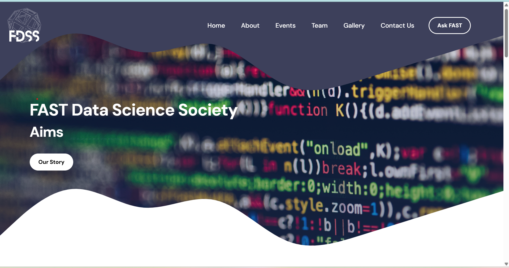
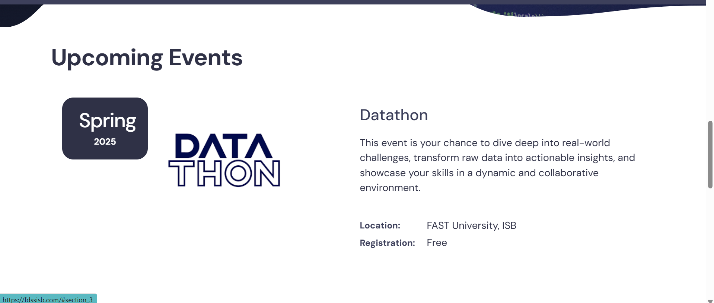
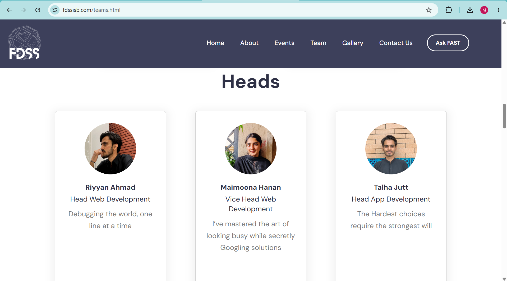

# FAST Data Science Society (FDSS) 2024 Website

## Overview

This repository contains the official website developed for the FAST Data Science Society (FDSS) 2024. The website was designed and implemented by the Web Development Team to provide information about the society, its events, initiatives, team members, and opportunities for student engagement.

## Features

* Responsive and user-friendly design
* Society information and mission
* Event and workshop highlights
* Team and executive body showcase
* Contact and social media integration
* Modern UI built with front-end technologies

## Technologies Used

* HTML5
* CSS3
* JavaScript

## My Contribution

Served as **Vice Head of Web Development** for the FAST Data Science Society (FDSS). Contributed to the planning, development, testing, and deployment of the society website while coordinating with team members to ensure timely project completion.

## Team

Developed collaboratively by the FDSS Web Development Team 2024.

## Screenshots

### Homepage

### About

### Events Section

### Team Section

## License

This project is intended for educational and organizational purposes.
